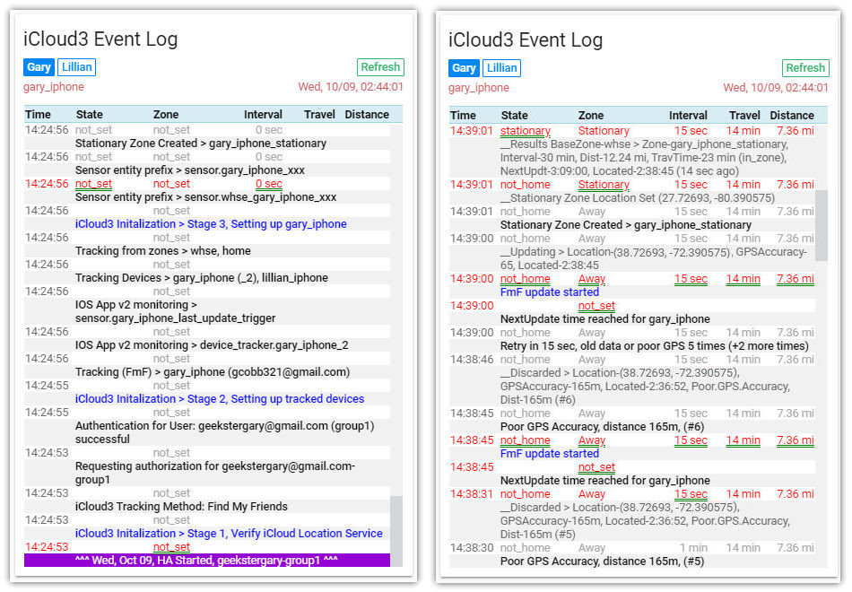

## Version 2.0 - 10/25/2019

### Breaking Changes

#### Configuration Parameters Changes

##### Deleted Configuration Parameters

- include_devices/include_device
- include_device_types/include_device_type
- exclude_devices/exclude_device
- exclude_device_types/exclude_device_type
- filter_devices
- sensor_name_prefix
- sensor_badge_picture
- base_zone (iCloud3 beta version)
- account (replaced by *group*)
- distance (replaced by *zone_distance*)

##### New Configuration Parameters

- group - Replaces *account* parameter obsoleted by new tracking methods
- tracking_method - Specify how devices should be tracked (Find-my-Friends, Find-my-Phone, HA IOS App)
- tracked_devices - Specifies devices to be tracked
- create_sensors - Create only the device tracking sensors that are specified
- exclude_sensors - Create all device tracking sensors except the ones specified
- zone_distance - The distance from the device to the zone (Home or another zone being used as the basis for distance and interval calculations). This was done to avoid conflicts with the HA IOS App which also has a *distance* attribute/sensor.  
- old_location_threshold - If the location is older then this value, it will be discarded and the device will be repolled until a current location is returned. 
- log_level - Display debug information on the Home Assistant Log File

##### Renamed Setvice Calls
The following device_tracker service calls were renamed for clarity and to avoid confusion with the interhan HA icloud device_tracker platform. Basically, 'icloud_XXX' was changed to 'icloud3_XXX'.

| New Name | Old Name |
|----------|----------|
| icloud3_update | icloud_update |
| icloud3_set_interval | icloud_set_interval |
| icloud3_restart | icloud_restart |
| icloud3_lost_phone | icloud_lost_phone |

### Other Changes

#### Tracking Method *Find-my-Friends* supports non-2fa iCloud accounts

Cloud3 can now track devices using the iCloud *Find-my-Friends* Location Services. iCloud3 version 1.0.x located devices using the iCloud Find-my-Phone Location service. If the account used 2-factor authentication, notifications were sent to trusted devices every half-hour or so indicating the iCloud account had been logged into. This made using this service unworkable. With *Find-my-Friends*, iCloud3 can now locate devices tied to a 2fa account (the friends) using another non-2fa account. Instructions for setting up *Find-my-Friends* is found in the iCloud3 documentation.

In order to support this, devices must be defined by their name instead of scanning the iCloud account looking for devices set up as family members (the *include_device_type* parameter). The following configuration parameters have been replaced by the new *track_devices/track_device* configuration parameter: 
      - include_devices/include_device
      - include_device_types/include_device_type
      - exclude_devices/exclude_device
      - exclude_device_types/exclude_device_type
      - filter_devices
      - sensor_name_prefix
      - sensor_badge_picture

!> The *tracking_method* parameter indicates how iCloud3 should track devices (devices in the iCloud Family Sharing list (famshr)), iCloud Find-My-Friends (fmf) or the HA IOS App (iosapp)

!> The *track_devices/track_device* parameter specifies the devices to track. The format of the parameter is:

 `devicename > email_addr, picture.jpg, IOSApp_info, zone_name, sensor_prefix`

#### Support for HA IOS App Version 2

Version 1 off the IOS App allows you to specify the devicename within the app itself. This lets iCloud3 directly monitor zone enter/exit triggers, manual location updates, significant location updates and background fetch notifications for the device. You can no longer specify the devicename associated with the device in version 2 of the HA IOS App, Instead, the devicename is created automatically and associated with the device in the HA Entity Registry file. Many sensors are also created for the device which can have different names than the device's device_tracker entity name.

iCloud3 continues to support IOS App version 1 and automatically scans the HA Entity Registry file, locating the device_tracker and sensor entities associated with the devicename.

!>Both versions can be used at the same time for different devices on the same account. Some can use version 1 and others can use version 2 based on the IOS App version installed on the device.

#### iCloud3 Documentation Updates

The documentation for iCloud3 has been completely reformatted and is now much easier to read, has many more examples and is better organized.

#### pyicloud_ic3.py Custom Component

*pyicloud.py* is a custom component module that interfaces between iCloud3 (and many other programs) and the iCloud Location Services that provides location tracking for Apple devices. This component has been customized to support the Find-My-Friends tracking method. You will need to install both the *device_tracker.py* and *pyicloud_ic3.py* files into the *custom_components/icloud3* directory.

#### Track Devices from Other Zones

Previously, the distance and time calculations are based on the device's location as it relates to the Home zone. You can now calculate this same information for other zones. Viewing this information, monitoring it and developing automations and scripts for the other zone much easier than before. The Waze travel time is calculated for each zone and can be displayed on a Lovelace card.

#### iCloud3 Event Log Custom Lovelace Card

iCloud3 logs many activities while it starts up, tracks devices, encounters errors, etc. to the HA log file. It also logs them to an internal event log that can be displayed on a custom Lovelace card. 

#### Customize Sensors Created by iCloud3

iCloud3 creates many sensors to report tracking, location and other information about the device. You can now control what sensors are created using the new *create_sensors* and *exclude_sensors* configuration parameter. A code is assigned to every sensor that is created. The *create_sensors* parameter will only create the ones you specify while the *exclude_sensors* will create all the sensors normally created except for the ones you specify.

Example: 

- *create_sensors: zon,zon1,ttim,zdis,cdis,wdis,nupdt,lupdt,info*
- *exclude_sensors: zon2,zon3,lzon2,lzon3,zon,zonts,bat*  

#### Other Changes

- Changed the way a date is displayed to be able to run on a Windows based linux platform.
- Code cleanup and optimization.

------

