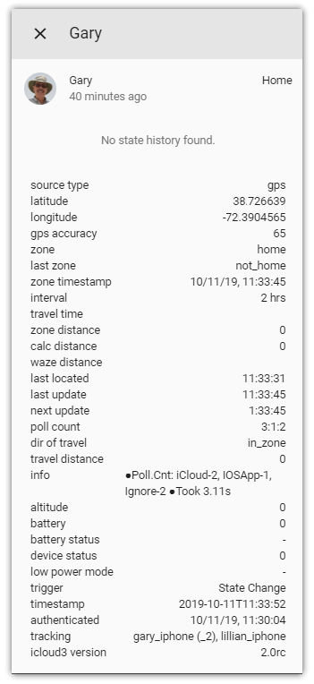

# iCloud3 Attributes

Many attributes are updated when the device is polled for it's location, distance and the travel time from Home or another zone. They can be used in automations and scripts and displayed on Lovelace Cards.  Sensors are created also for many of the attributes and are discussed in further detail in the Sensors chapter.

### Location and Polling Attributes

The following attributes are all based on the zone's location. The information for the Home zone is always calculated. They are also calculated when another zone is found on the `track_devices` parameter for a device. You can have more than one zone on the configuration parameter for a device. For example:

- to monitor the distance and travel time to work (offc zone):  
	`gary_iphone > gary-icloud-acct@email.com, gary.png, offc`
- to monitor the distance and travel time to work (offc zone) and to school:  
	`gary_iphone > gary-icloud-acct@email.com, gary.png, offc, school`

!> The device_tracker.devicename_attributes always show the information as it relates to the Home zone. Additional sensors are created for the distance and time information that is calculated for the other zones.

###### interval 
The current interval between location update requests sent to your iCloud account. 

###### travel_time 
The Waze travel time to arrive at the `base zone` from your current location.  

###### zone_distance 
The distance from the `base zone` (i.e., home, office). This will be either the Waze distance or the calculated distance.  

###### waze_distance 
The driving distance from the `base zone` returned by Waze based on the shortest route.  

###### calc_distance 
The 'straight line' distance that is calculated using the latitude and longitude of the `base zone` and your current location using geometric formulas.  

###### zone, last_zone 
The device's current and last zone. This is not to be confused with the device's state. The state can be changed by other programs (IOS app or automations issuing device_tracker.see service calls) where the zone attribute is only updated by iCloud3. Using the Zone attribute to trigger an automation eliminates the gps wandering problems (or greatly reduces them). 

###### zone_name_1, zone_name_2, zone_name_3, last_zone_name_1, last_zone_name_2, last_zone_name_3
A formatted name for the zone and the previous zone. See the Using Sensors chapter for examples. 

###### zone_timestamp 
When the device's zone attribute was last changed.

###### dir_of_travel 
The direction you are traveling — towards, away, near, or stationary. This is determined by calculating the difference between the distance from the `base zone` on this location update and the last one. Stationary can be a little difficult to determine at times and sometimes needs several updates to get right.  

###### last_update 
The time of the last iCloud location update.  

###### next_update 
The time of the next iCloud location update.  

###### last_located 
The last time your iCloud account successfully located the device. Normally, this will be a few seconds after the update time, however, if you are in a dead zone or the GPS accuracy exceeds the threshold, the time will be older. In this case, a description of the issues is displayed in the `info` attribute field.  

### Device Status Information Attributes

###### latitude, longitude, altitude 
The location of the device based on information received from the iCloud location services or the IOS App.  

###### info 
A message area displaying information about the device. This includes the errors, battery level, Waze status, GPS accuracy issues, how long the device has been stationary, etc.  

###### trigger 
The action or notification that caused the last update (Geographic Zone Entered or Exited, Background Fetch, Manual, iCloud, etc.).

###### timestamp 
When the last update was completed.

###### poll_count 
The number of iCloud, IOS App and discarded transaction counts for the day. It's format is '##:##:##'. For example, a value of '10 : 14 : 21' indicates the iCloud account was polled 10 times, the IOS App sent 14 triggers and  21 transactions were discarded because they were more than 2-minutes old or had a  GPS accuracy that was more than the `gps_accuracy_threshold` configuration parameter.

###### battery 
The battery level of the device. This is not available for the Find-my-Friends tracking method or when using the IOS App version 2. 

###### battery_status 
Charging or NotCharging. This is not available for the Find-my-Friends tracking method or when using the IOS App version 2. 

###### source_type 
How the the HA IOS App located the device. This includes gps, beacon, router.  

###### device_status 
The status of the device — online if the device is located or offline if polling has been paused or it can not be located.  

###### low_power_mode 
If the device is running in low power mode.

###### course, floor, vertical_accuracy 
Device information provided by the iCloud account.  This information is not verified by iCloud3 and passed along as reported by the IOS app.

### Other Attributes

###### authenticated 
When the device's iCloud account was last authenticated.  

###### tracking 
The devices that are being tracked based on the `track_devices` configuration parameter. The devices are verified when iCloud3 starts (valid email address, valid devicename, etc.). The device's suffix number is displayed if the device is using the IOS App version 2 `(_2)`.  

###### icloud3_version 
The version of iCloud3 you are running.  
